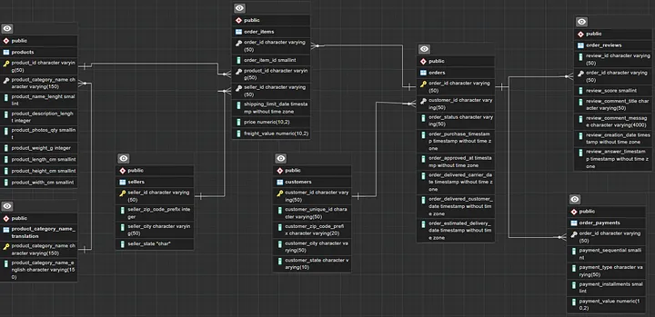

# SQL-Project
Hello,

I attended for data science training. I have completed the sql block training, which is the first stage of the training in the course. At the end of each block, we have project studies. I would like to share my SQL project with you.

I will proceed with the project through questions and answers.

Dataset Link: Brazilian E-Commerce Public Dataset by Olist | Kaggle

# Question 1: Create ERD by creating the database from the data set in the given link and add it visually. Geolocation table will not be used in the project.

# Case 1 : Order Analysis
# Question 1: Examine the order distribution on a monthly basis. For date data, order_approved_at should be used.

select 
 to_char(order_approved_at,'YYYY-MM') as payment_month,
 count(o.order_id) as order_sayi
from orders o
where to_char(order_approved_at,'YYYY-MM') is not null
group by 1
order by 1
NOTE : I did not take 160 records returning null because the payment month field is not clear.

Sample output