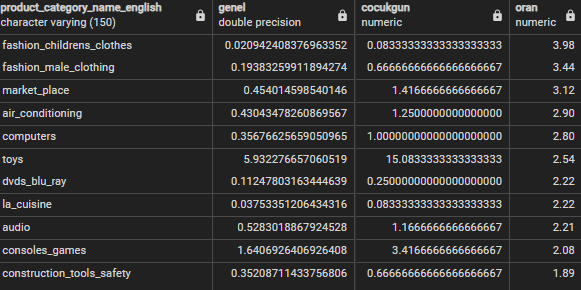
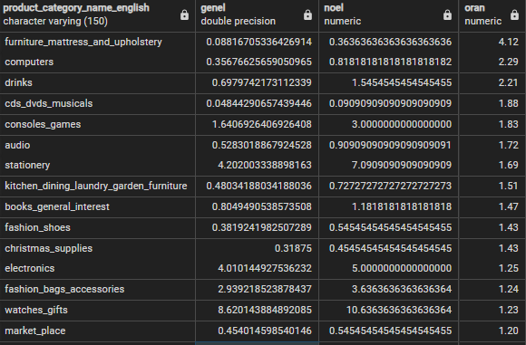
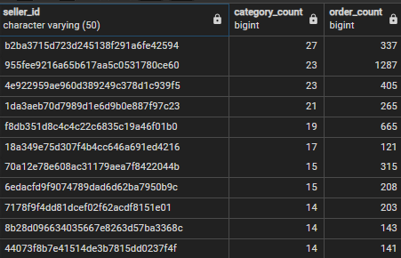
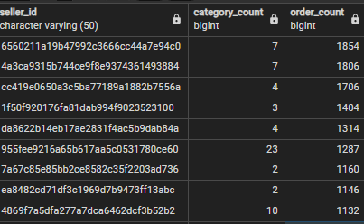
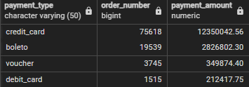
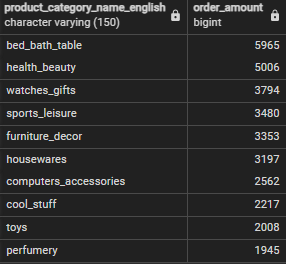
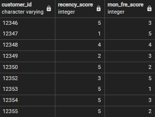


### SQL PROJE

Verilen linkteki veri setinden veri tabanını oluşturarak ERD oluşturunuz ve görsel olarak ekleyiniz. Geolocation tablosu projede kullanılmayacaktır.

`	`Link : [Brazilian E-Commerce Public Dataset by Olist | Kaggle](https://www.kaggle.com/datasets/olistbr/brazilian-ecommerce)

#### **Örnek Case Çözümü** 

-Aylık bazda toplam ödeme tutarı analizi yapıp excelde görselleştiriniz. Datayı yorumlayınız.

**SQL Query:** 

**SELECT** 

`      `**(date\_trunc('month',o.order\_approved\_at))::date AS payment\_month,**

`       `**(sum(payment\_value))::integer AS total\_payment\_value**

`  `**FROM payments AS p**

`  `**LEFT JOIN orders AS o**

`    `**ON o.order\_id = p.order\_id**

` `**WHERE o.order\_approved\_at IS NOT NULL**

` `**GROUP BY 1**

` `**ORDER BY payment\_month**

Çıktıyı incelediğimizde order sayılarında aylar içinde düzenli bir artış görüyoruz. Fakat Kasım 2017’de dramatik bir artış söz konusu, bunun sebebi ilgili ayda yapılan bir kampanya,özel bir gün (örneğin Türkiye’de bayram dönemlerinde maaşlara ek promosyon yattığında insanların daha fazla alışveriş yapması gibi) ya da tüm dünyada Kasım ayında uygulanan black friday etkili olmuş olabilir. 

2018 yılında da Ocak ayında bir artış söz konusu, bunun sebebi yeni yılda yapılan maaş artışı ya da noel olabilir. 

Elimizdeki veri ile yıl bazlı mevsim değerlendirmesi yapmak zor çünkü 2016 yılına ait veri çok az, 2017’de sezondan bağımsız bir artış görünüyor, 2018 yılında ise kış ve bahar ayları hemen hemen aynı verimlilikte geçmiş gibi görünüyor. Sezon incelemesi yapmak için verimiz pek yeterli değil.

####
####
####
####

#### **Case 1 : Sipariş Analizi**
##### Question 1 : 
-Aylık olarak order dağılımını inceleyiniz. Tarih verisi için order\_approved\_at kullanılmalıdır.

**select** 

`	`**to\_char(order\_approved\_at,'YYYY-MM') as payment\_month,**

`	`**count(o.order\_id) as order\_sayi**

**from orders o**

**where to\_char(order\_approved\_at,'YYYY-MM') is not null**

**group by 1**

**order by 1**

**\*\*NOT : sonucu null dönen 160 kaydı payment month alanı belli olmadığı için almadım.**
**

**Örnek Çıktı:** 

##### Question 2 : 
-Aylık olarak order status kırılımında order sayılarını inceleyiniz. Sorgu sonucunda çıkan outputu excel ile görselleştiriniz. Dramatik bir düşüşün ya da yükselişin olduğu aylar var mı? Veriyi inceleyerek yorumlayınız.

**--Order statüsü iptal ya da mevcut olmayan olan dışındakiler için sorgu**

**select** 

`	`**to\_char(order\_approved\_at,'YYYY-MM') as payment\_month,**

`	`**order\_status,**

`	`**count(order\_id) as order\_count**

**from orders** 

**where order\_status not in ('canceled','unavailable')**

`	`**and to\_char(order\_approved\_at,'YYYY-MM') is not null**

**group by 1,2**

**order by 1,2**

**--iptal ya da mevcut olmayan siparişler için sorgu**

**select** 

`	`**to\_char(order\_approved\_at,'YYYY-MM') as payment\_month,**

`	`**order\_status,**

`	`**count(order\_id) as order\_count**

**from orders** 

**where order\_status  in ('canceled','unavailable')**

`	`**and to\_char(order\_approved\_at,'YYYY-MM') is not null**

**group by 1,2**

**order by 1,2**

**YORUMLARIM** 

- 2017 yılına genel olarak baktığımda sipariş sayısında birkaç istisna dışında istikrarlı bir artış görüyorum.
- 2017 kasımda grafikte ekstrem bir artış olmuş. Datayı incelediğimde "bed\_bath\_table",

  "furniture\_decor" ürünleri ilk sıralarda geliyor. Bunun sebebi internette bulduğum makalede, Brezilya’nın güçlü bir mobilya endüstrisine sahip olduğunu ve  satışların yılın dördüncü çeyreğinde yoğunlaştığını, eylül, ekim ve kasım aylarında mobilya üretim ve ithalat hacmi arttığını buldum. Bu çeyrekte son ay olan kasım ayında belki indirim, kampanya vs gibi nedenlerden dolayı satışlar yoğunlaşmış olabilir. 

  Aynı zamanda black friday satışları da etkili olmuş olabilir. 

- Aralık ayındaki ani düşüşün de furniture dekor kategorisinin satışında azalma meydana geldiği için olabilir. 
- Ocak ayında maaşlara yıllık zam olmuş olabilir, martta tekrar artışın olması da karnaval zamanlarının o tarihe gelmiş olmasından olabilir.
- Mayıs ayından sonra gelen haziran, temmuz aylarında özellikle temmuz ayında yılın en soğuk günü oluyormuş. Bu da aslında grafikte kendini göstermiş. Turizmin azalması ve yerli halkın daha çok ev aktivitelerine katılması siparişleri azaltmış olabilir.
- 2018 eylül ayı için yetersiz veriden dolayı yorum yapamayacağım.
- İkinci grafikte de çok sipariş olunca iptaller  ve erişilemez kayıtları da diğer aylara göre beraberinde  getirmiş. 2018 şubat ayında ekstra fazla iptal, erişilemez kayıtlar olmuş.

##### Question 3 : 

-Ürün kategorisi kırılımında sipariş sayılarını inceleyiniz. Özel günlerde öne çıkan kategoriler nelerdir? Örneğin yılbaşı, sevgililer günü…

**\*\*NOT: Özel günleri 14 şubat sevgililer günü, 12 ekim çocuk günü, 25 aralık noel gibi özel günleri inceledim. Genel ortalama ve belirlediğim ortalamaya göre yorum yapamadım.**

- **14 şubat için : On gün öncesinden verileri inceledim.** 
- **12 ekim için  :  Ekim ayı başından beri verilerini aldım.**
- **25 aralık: On gün öncesinden verileri aldım.**

**–14 Şubat için**

**with genel as (select**

`	`**product\_category\_name\_english,**

`	`**count(o.order\_id) / NULLIF(DATE\_PART('day',max(o.order\_purchase\_timestamp)-    min(o.order\_purchase\_timestamp)),0) as genel**

**from orders o**

**inner join order\_items o\_i**

**on o.order\_id = o\_i.order\_id**

**inner join products p on o\_i.product\_id = p.product\_id**

**inner join product\_category\_name\_translation p\_t on p\_t.product\_category\_name  = p.product\_category\_name**

**group by 1**

**),**

**sevgililerGunu as (**

**select**

`	`**product\_category\_name\_english,**

`	`**count(o.order\_id) / 11.0 as sevgGun**

**from orders o**

**inner join order\_items o\_i**

**on o.order\_id = o\_i.order\_id**

**inner join products p on o\_i.product\_id = p.product\_id**

**inner join public.product\_category\_name\_translation p\_t on p\_t.product\_category\_name  = p.product\_category\_name**

**where to\_char(o.order\_purchase\_timestamp,'MM-DD') between '02-04' and '02-14'** 

**group by 1**

**)**

**select g.product\_category\_name\_english,**

**genel,**

**sevgGun,**

**round((sevgGun/genel)::decimal,2) oran**

**from genel g**

**inner join sevgililerGunu  s on g.product\_category\_name\_english = s.product\_category\_name\_english**

**order by  oran desc**

**Çıktı Örnek:**

**YORUMLARIM** 
**

- Sevgililer günü bazında sorguyu incelediğimde sevgililer günü etkisini çok göremedim.

  “fashio\_female\_clothing” kısmında biraz etkisi var gibi ama öncesindeki market\_place ve christmas\_supplies fazla gelmesi  şubat veya mart ayında düzenlenen Rio karnavalının etkisi gibi. Ayrıca “fashio\_underwer\_beach” etkisi de o aylarda sıcaklığın fazla olmasıdır.

**–12 Ekim Çocuklar Günü**

**with genel as (select**

`	`**product\_category\_name\_english,**

`	`**count(o.order\_id) / NULLIF(DATE\_PART('day',max(o.order\_purchase\_timestamp)- min(o.order\_purchase\_timestamp)),0) as genel**

**from orders o**

**inner join order\_items o\_i**

**on o.order\_id = o\_i.order\_id**

**inner join products p on o\_i.product\_id = p.product\_id**

**inner join product\_category\_name\_translation p\_t on p\_t.product\_category\_name  = p.product\_category\_name**

**group by 1**

**order by 2 desc),**

**CocuklarGunu as (**

**select**

`	`**product\_category\_name\_english,**

`	`**count(o.order\_id) / 12.0 as cocukGun**

**from orders o**

**inner join order\_items o\_i**

**on o.order\_id = o\_i.order\_id**

**inner join products p on o\_i.product\_id = p.product\_id**

**inner join public.product\_category\_name\_translation p\_t on p\_t.product\_category\_name  = p.product\_category\_name**

**where to\_char(o.order\_purchase\_timestamp,'MM-DD') between '10-01'and '10-12'** 

**group by 1**

**order by 2 desc**

**)**

**select g.product\_category\_name\_english,**

**genel,**

**cocukGun,**

**round((cocukGun/genel)::decimal,2) oran**

**from genel g**

**inner join CocuklarGunu  s on g.product\_category\_name\_english = s.product\_category\_name\_english**

**order by  oran desc**

**YORUMLARIM:**

- **Veride çocuklar günü etkisini net görebiliyorum. clothingler, toys,computers, console\_games gibi ürünler çocuklara alınabilir.**

**–25 Aralık Noel Günü**

**with genel as (select**

`	`**product\_category\_name\_english,**

`	`**count(o.order\_id) / NULLIF(DATE\_PART('day',max(o.order\_purchase\_timestamp)- min(o.order\_purchase\_timestamp)),0) as genel**

**from orders o**

**inner join order\_items o\_i**

**on o.order\_id = o\_i.order\_id**

**inner join products p on o\_i.product\_id = p.product\_id**

**inner join product\_category\_name\_translation p\_t on p\_t.product\_category\_name  = p.product\_category\_name**

**group by 1**

**order by 2 desc),**

**NoelGunu as (**

**select**

`	`**product\_category\_name\_english,**

`	`**count(o.order\_id) / 11.0 as noel**

**from orders o**

**inner join order\_items o\_i**

**on o.order\_id = o\_i.order\_id**

**inner join products p on o\_i.product\_id = p.product\_id**

**inner join public.product\_category\_name\_translation p\_t on p\_t.product\_category\_name  = p.product\_category\_name**

**where to\_char(o.order\_purchase\_timestamp,'MM-DD') between '12-15'and '12-25'** 

**group by 1**

**order by 2 desc**

**)**

**select g.product\_category\_name\_english,**

**genel,**

**noel,**

**round((noel/genel)::decimal,2) oran**

**from genel g**

**inner join NoelGunu  s on g.product\_category\_name\_english = s.product\_category\_name\_english**

**order by  oran desc**

**YORUMLARIM:**

- **Noel gününü kontrol ettiğimde ilk sralardaçok özel bir ürün göremedim.**

  **Drinks, cds\_dvds-musicals, console\_games,audio ürünlerini görünce şöyle bir yorum yapabilirim ki, insanlar noelde genelde evinde ailesiyle, yakın arkadaşlarıyla müzik eşliğinde yemeli içmeli bir eğlence ya da konsol oyunlarıyla birlikte aktivite yapıyor olabilirler.**

##### Question 4 : 
-Haftanın günleri(pazartesi, perşembe, ….) ve ay günleri (ayın 1’i,2’si gibi) bazında order sayılarını inceleyiniz. Yazdığınız sorgunun outputu ile excel’de bir görsel oluşturup yorumlayınız.

**NOT:  Soru özelinde tarih alanını order\_purchase\_timestamp olarak aldım. Satın alma tarihine göre karşılaştırma yaptım**.

**–Gün bazında**

**select** 

`	`**to\_char(order\_purchase\_timestamp,'DAY') as purchase\_day,**

`	`**count(order\_id) as order\_sayi**

**from orders** 

**where to\_char(order\_purchase\_timestamp,'DAY') is not null**

**group by 1**

**YORUMLARIM:**

- **Araştırmama göre haftasonu insanlar dinlenme, eğlence, sosyal etkinlik aileleriyle vakit geçirme, spor etkinlikleri, konserler, festivaller veya diğer kültürel etkinliklere katılıyormuş ayrıca  yaygın olarak ziyaret edilen  plajlar da uğrak noktalarmış. Haftasonu sipariş sayısının az olması normaldir. Ekstrem bir durum olmadığı sürece pazar gününde de cumartesiye göre siparişlerin artması normal bir durumdur.**

**–Ayın günleri bazında**

**select** 

`	`**to\_char(order\_purchase\_timestamp,'DD') as purchase\_day,**

`	`**count(order\_id) as order\_sayi**

**from orders** 

**where to\_char(order\_purchase\_timestamp,'DD') is not null**

**group by 1**

**YORUMLARIM:**

- **Case 1: 2. sorudaki kasım ayındaki black friday ve mobilya sayısı artışı etkili olmuş olabilir.**
- **Bazı aylarda ayın 31 i olmadığı için siparişler az gelmiş olabilir. 28 sonrası hafif azalışlar da buna bağlı olabilir.**

#### **Case 2 : Müşteri Analizi** 
##### **Question 1 :** 
-Hangi şehirlerdeki müşteriler daha çok alışveriş yapıyor? Müşterinin şehrini en çok sipariş verdiği şehir olarak belirleyip analizi ona göre yapınız. 

**Örneğin; Sibel Çanakkale’den 3, Muğla’dan 8 ve İstanbul’dan 10 sipariş olmak üzere 3 farklı şehirden sipariş veriyor. Sibel’in şehrini en çok sipariş verdiği şehir olan İstanbul olarak seçmelisiniz ve Sibel’in yaptığı siparişleri İstanbul’dan 21 sipariş vermiş şekilde görünmelidir.**

**Sorgu:**

**with tablo as(**

**select** 

`	`**customer\_unique\_id,**

`	`**customer\_city,**

`	`**count(customer\_city) order\_sayisi**

**from customers**

**group by 1,2**

**),**

**tablo1 as(**

**select** 

`	`**customer\_unique\_id,**

`	`**customer\_city,**

`	`**order\_sayisi,**

`	`**row\_number() over** 

`		`**(partition by customer\_unique\_id order by order\_sayisi desc) rn**

`	`**from tablo),**

`	`**tablo2 as(**

`	`**select customer\_unique\_id,**

`		`**sum(order\_sayisi) toplam\_order\_sayisi**

`		`**from tablo1**

`		`**group by 1**

`		`**order by 1)**

`	`**select** 

`		`**t1.customer\_unique\_id,**

`		`**customer\_city,**

`		`**toplam\_order\_sayisi**

`	`**from tablo1 t1**

`	`**join tablo2 t2 on t1.customer\_unique\_id = t2.customer\_unique\_id**

`	`**where rn =1**

`	`**order by 3 desc**

#### **Case 3: Satıcı Analizi**
##### Question 1 : 
-Siparişleri en hızlı şekilde müşterilere ulaştıran satıcılar kimlerdir? Top 5 getiriniz. Bu satıcıların order sayıları ile ürünlerindeki yorumlar ve puanlamaları inceleyiniz ve yorumlayınız.

**\*\*NOT:** 

**–**Hızlı satıcıları  siparişin onaylanıp müşteriye teslim olana kadar olan fark tarihi aldım

yani order tablosunda order\_delivered\_customer\_date - order\_approved\_at şeklinde aldım.

Ekstra olarak “order\_delivered\_customer\_date” alanları boş gelince sipariş müşteriye ulaşmamış duruyordu. Bu yüzden 2538 kaydı devre dışı bırakmış oldum. 112650 kayıttan 110112 kaydı inceledim. Bu kayıtlardan da genel order sayılarının ortalamalarını buldum, ortalama 33 sipariş oldu.

**SORGU:**

**with siparis\_bilgi as**

**(select**

`	`**seller\_id,**

`	`**count(distinct o.order\_id) order\_sayi,**

`	`**avg(order\_delivered\_customer\_date - order\_approved\_at)  as avg\_delivery\_time**

**from  orders o**

**inner join order\_items o\_i**

**on o.order\_id = o\_i.order\_id**

**where order\_delivered\_customer\_date is not null**

**and order\_approved\_at is not null  and** 

**order\_approved\_at<= order\_delivered\_customer\_date**

**group by  1**

**),**

**--select round(avg(order\_sayi)) from  siparis\_bilgi**

**--top 5 sorgusu ve çıktısı aşağıdaki gibidir.**

**top5 as (**

**select**

`	`**seller\_id,**

`	`**count(distinct o.order\_id) order\_sayi,**

`	`**avg(order\_delivered\_customer\_date-order\_approved\_at)  as avg\_delivery\_time**

**from  orders o**

**inner join order\_items o\_i**

**on o.order\_id = o\_i.order\_id**

**where order\_delivered\_customer\_date is not null**

**and order\_approved\_at is not null  and** 

**order\_approved\_at<= order\_delivered\_customer\_date**

**group by  1**

**HAVING count(distinct o.order\_id) >= (select round(avg(order\_sayi)) from  siparis\_bilgi)**

**)**

**select \* from top5**

` `**order by 3 asc**

` `**limit 5;**

**–Sorgunun ikinci kısmı çıktısı ve sorgusu**

**with b  as (**

**select** 

`	`**distinct o.order\_id,**

`	`**oi.seller\_id,**

`	`**o\_r.review\_score,**

`	`**o\_r.review\_comment\_message**

**from order\_items oi**

**inner join** 

**(select**

`	`**seller\_id,**

`	`**count( distinct o.order\_id) order\_sayi,**

`	`**avg(order\_delivered\_customer\_date-order\_approved\_at)  as avg\_delivery\_time**

**from  orders o**

**inner join order\_items o\_i**

**on o.order\_id = o\_i.order\_id**

**where order\_delivered\_customer\_date is not null**

**and order\_approved\_at is not null  and** 

**order\_approved\_at<= order\_delivered\_customer\_date**

**group by  1**

**HAVING count( distinct o.order\_id) >= 33**

` `**order by 3 asc**

` `**limit 5**

**) siparis**

**on oi.seller\_id = siparis.seller\_id**

**inner join orders o**

**on o.order\_id= oi.order\_id**

**left join order\_reviews o\_r**

**on o.order\_id = o\_r.order\_id**

**where o.order\_delivered\_customer\_date is not null**

**and o.order\_approved\_at is not null  and** 

**o.order\_approved\_at<= o.order\_delivered\_customer\_date**

**)**

**select** 

**b.seller\_id,**

**round(avg(b.review\_score)) avg\_score,**

**count(b.review\_comment\_message) comment\_message**

**from b**

**group by 1** 

**order by 2 desc, 3 desc**

**YORUMLARIM:**

- Sorgunun son kısmı yerine  aşağıdaki sorguyu ekleyip çalıştırınca yorumları inceledim.

  Toplam 73 farklı yorum vardı, 22 tanesinde ürünü beğenmeyen, görseldeki gibi olmadığını belirten, iade süreci hakkında yorum yapan, eksik/farklı gelen, teslim edilmeyen, kullanılmış ürün gelen ya da garantisi olmayan ürün yorumları gördüm. Genel olarak hepsinde siparişin hızlı olduğu belirtilmiş. Güzel yorumlardan bazıları siteyi öven, ürünleri beğenip tavsiye edenler bulunmakta.

- ` `Genel olarak kargodan memnun kalınmış, yüzdesel çoğunluk ürünü,siteyi beğenmiş ve tavsiye etmiş.

**select** 

**distinct b.review\_comment\_message comment\_message,**

**b.seller\_id,**

**round(avg(b.review\_score)) avg\_score**

**from b**

**where b.review\_comment\_message is not null**

**group by 1,2** 

**order by 2, 3 desc**

##### Question 2 : 
-Hangi satıcılar daha fazla kategoriye ait ürün satışı yapmaktadır? 

` `Fazla kategoriye sahip satıcıların order sayıları da fazla mı? 

**Not:** Order  status ve sipariş teslimine bakmadan tüm siparişler bazında inceledim.

select \* from order\_items

where seller\_id= 'dd7ddc04e1b6c2c614352b383efe2d36'

and order\_id ='0ddd5a236d9e9023c6b2dc4e0ae35efe'

order by order\_id --Aynı siparişte aynı kategoride 2 adet var, bu tek bir sipariş sebebinden dolayı orderları **distinctledim.**

**Kontrol Çıktı**: "dd7ddc04e1b6c2c614352b383efe2d36"	"pet\_shop"	1

Aşağıdaki sorgu sonucunda :  3033 kayıt gelmektedir.

**Asıl SQL:**

select 

`	`seller\_id,

`	`count( distinct p\_t.product\_category\_name\_english) as category\_count,

`	`count(distinct o\_i.order\_id) as order\_count

from order\_items o\_i

inner join products p on o\_i.product\_id = p.product\_id

inner join product\_category\_name\_translation p\_t on p.product\_category\_name = p\_t.product\_category\_name

group by 1

order by 2 desc, 3 desc

limit 11;

**Fazla kategoriye sahip satıcıların order sayıları da fazla mı?** 

- Sorusu için keskin bir yorum yapamayız sıralamayı order count detayında yapınca  aşağıdaki ekran görüntüsündeki gibi kategorisi yukarıdaki ekran görüntüsünden az olanların sipariş miktarlarının fazla olduğunu gördüm. Yani sorudaki gibi yorum yapamayız.

#### **Case 4 : Payment Analizi**
##### Question 1 : 
-Ödeme yaparken taksit sayısı fazla olan kullanıcılar en çok hangi bölgede yaşamaktadır? Bu çıktıyı yorumlayınız.

**Sorgu:**

**Alttaki sorguya göre ortalama taksit sayısına eşit ve büyük olanları getirdim.**

**max istersek de:**  

- where payment\_installments >= (select  max(payment\_installments) from order\_payments) şeklinde sorgu düzenlenebilir. **Her ikisinde de maksimum taksit sayısı 24 gösteriyor.**

select 

`	`distinct customer\_unique\_id,

`	`customer\_city,

`	`payment\_installments

from  customers c

inner join orders o on c.customer\_id = o.customer\_id

inner join order\_payments o\_p on o.order\_id = o\_p.order\_id

where payment\_installments >= (select 							   	  				round(avg(payment\_installments))

`				      `from order\_payments)					

order by 3 desc

**Eyalet Sorgusu:**

**select** 

`	`**distinct customer\_state,**

`	`**–payment\_installments**

**from  customers c**

**inner join orders o on c.customer\_id = o.customer\_id**

**inner join order\_payments o\_p on o.order\_id = o\_p.order\_id**

**where payment\_installments >= (select** 

`							   	  `**max(payment\_installments)**

`							    `**from order\_payments)**					

**order by 1 desc**

**Eyaletleri:** "SP","RS","RO","RJ","PR","PB","MG","GO","DF","CE","BA"

**Sao Paulo,Rio Grande do Sul,Rondonia,Rio de Januaryeiro,Paraiba,Minas Gerais,Distrito Federal,Ceara,Bahia**

**YORUMUM: Kıyı şeritlerdeki eyaletlerdeki insanlar daha çok taksitli yani daha pahalı ürün almaya yatkın diyebiliriz.**

##### Question 2 : 
-Ödeme tipine göre başarılı order sayısı ve toplam başarılı ödeme tutarını hesaplayınız. En çok kullanılan ödeme tipinden en az olana göre sıralayınız.

**Sorgu:** 

select 

`	`payment\_type,

`	`count(distinct o.order\_id) as order\_number,

`    `sum(payment\_value) as payment\_amount 	

from orders o

inner join order\_payments o\_p on o.order\_id= o\_p.order\_id

where order\_status not in ('canceled','unavailable')

` `group by 1

order by 3 desc

**Çıktı:**

##### Question 3 : 
-Tek çekimde ve taksitle ödenen siparişlerin kategori bazlı analizini yapınız. En çok hangi kategorilerde taksitle ödeme kullanılmaktadır?

**–Tek Çekim Olanlar**

select 

`	`product\_category\_name\_english,

`	`count(distinct  o\_p.order\_id) as order\_amount

from order\_payments o\_p

inner join order\_items o\_i on o\_p.order\_id = o\_i.order\_id

inner join products p on p.product\_id = o\_i.product\_id

inner join product\_category\_name\_translation p\_c\_n on p.product\_category\_name = p\_c\_n.product\_category\_name

where payment\_installments =1

group by 1

order by 2 desc

limit 10

**–Taksitli olanlar**

select 

`	`product\_category\_name\_english,

`	`count(distinct  o\_p.order\_id) as order\_amount

from order\_payments o\_p

inner join order\_items o\_i on o\_p.order\_id = o\_i.order\_id

inner join products p on p.product\_id = o\_i.product\_id

inner join product\_category\_name\_translation p\_c\_n on p.product\_category\_name = p\_c\_n.product\_category\_name

where payment\_installments > 1

group by 1

order by 2 desc

limit 10

#### **Case 5 : RFM Analizi**

Aşağıdaki e\_commerce\_data\_.csv doyasındaki veri setini kullanarak RFM analizi yapınız. 
Recency hesaplarken bugünün tarihi değil en son sipariş tarihini baz alınız. 

Veri seti bu linkten alınmıştır, veriyi tanımak için linke girip inceleyebilirsiniz.

[E-Commerce Data](https://www.kaggle.com/datasets/carrie1/ecommerce-data)

**NOT**: quantity, unitprice negatifleri ve customer id null olanları çıkardım.

Bugünün tarihi yerine max tarih: **InvoiceDate** :2011-12-09 aldım.

select max(invoicedate) from rfm -- 2011-12-09

Amount = UnitPrice \* Quantity şeklinde aldım.

Recency ve Frequency analizlerimde datayı ntile ile düzgün bölemediğim için manuel case when yaptım.

**SORGU:**

With max\_i\_d as (

`	`select 

`		`customer\_id,

`		`max(invoicedate)::date as max\_invoicedate

`	`from rfm

`	`where customer\_id is not null 

`	`and quantity > 0  and unitprice >0 

`	`group by 1

),

recency as (

`	`select 

`		`customer\_id,

`		`max\_invoicedate,

`		`('2011-12-09' - max\_invoicedate :: date) as recency

`	`from max\_i\_d

) ,--4338 --867

--12 dahil :1,13-32: 2,33-71 dahil:3, 21-179:4,

frequency as (

select 

`	`customer\_id,

`	`count(distinct invoiceno) as frequency

from rfm

where customer\_id is not null 

and quantity > 0  and unitprice >0 

group by customer\_id

),

monetary as (

select 

`	`customer\_id,

`	`round(sum(unitprice\*quantity)::decimal,2) as monetary	

from rfm

where customer\_id is not null 

and quantity > 0  and unitprice >0 

group by 1

),

scores as (

`	`select 

`	`r.customer\_id,

`	`r.recency,

`	`----12 dahil :1,13-32: 2,33-71 dahil:3, 72-179:4,

`	`case when r.recency >= 0 and r.recency <= 12 then 1

`	`when r.recency >= 13 and r.recency <= 32 then 2

`	`when r.recency >= 33 and r.recency <= 71  then 3

`	`when r.recency >= 72 and r.recency <= 179  then 4

`	`else 5 end as recency\_score,

`	`f.frequency,

`	`case when f.frequency >= 1 and f.frequency <= 2 then f.frequency

`	`when f.frequency >= 3 and f.frequency <= 4 then 3

`	`when f.frequency >= 5 and f.frequency <= 7  then 4

`	`else 5 end as frequency\_score,

`	`m.monetary,

`	`ntile(5) over (order by monetary) as monetary\_score

`	`from recency as r

`	`left join frequency as f on r.customer\_id = f.customer\_id

`	`left join monetary as m on r.customer\_id = m.customer\_id

),

merge\_mont\_fre as (

`	`select 

`		`customer\_id,

`		`recency\_score,

`		`monetary\_score + frequency\_score as mon\_fre\_score

`	`from scores

),

rfm\_score as (

`	`select 

`	`customer\_id,

`	`recency\_score,

`	`ntile(5) over (order by mon\_fre\_score) as mon\_fre\_score

`	`from merge\_mont\_fre

)

select \* from rfm\_score

**Örnek Çıktı:**

Fatma Hanım, öncelikle ellerinize ve emeğinize sağlık. Üzerinde çok emek harcanmış gerçekten başarılı bir ürün ortaya koymuşsunuz. SQL syntaxı ile ilgili neredeyse hiç bir probleminizin olduğunu düşünmüyorum. Kafanızda tasarladığınız her şeyi koda dökebiliyorsunuz. Ayrıca sorgu sonucu elde ettiğiniz tabloları görselleştirmeleriniz ve o görselleri yorumlamanız da gayet başarılı. Size bir önerim olacak. Yapmış olduğunuz bu projeyi githubınıza yükleyebilir, bir medium makalesi haline getirebilir sonrasında linkedininizde paylaşabilirsiniz. Eğer böyle bir şey yapacak olursanız lütfen bana da haber veriniz. Biz de github reponuza star verelim, medium makalenize upvote yapalım. Ayrıca bu çözümünüzü en baştan bütün aşamaları ile kaydederek youtube da da yayınlayabilirsiniz.

Tekrardan tebrik ediyor başarılarınızın devamını diliyorum.

